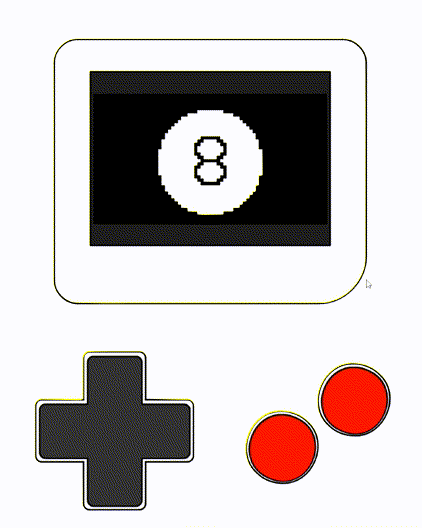

# Magic 8 Ball For Your Thumby
With modern technology, the mysterious, all-knowing ball answers to your thumb now.

A ~~simple~~ mystical app for [TinyCircuits](https://tinycircuits.com/)' upcoming [Thumby](https://thumby.us/) miniature keychain-size gaming console.

## Running it in the Emulator:
TinyCircuits has provided a handy [IDE with built-in Thumby emulator](https://tinycircuits.github.io/)!

To try this app (or any others), just:
1. Navigate to https://tinycircuits.github.io/
2. Paste the code from [magic_8_ball.py](magic_8_ball.py) into the main text editor window, replacing all the existing code (save your current workspace if you have any unsaved work)
3. Click the "EMULATE" button above the text editor

Or:
1. Clone this repo locally OR just download the [magic_8_ball.py](magic_8_ball.py) file locally
2. Navigate to https://tinycircuits.github.io/
3. Click the FILE > "IMPORT FROM PC" button above the text editor
4. Navigate the file selector to the `magic_8_ball.py` file you downloaded locally in step 1.
5. Click the "EMULATE" button above the text editor

## Running it on the Thumby
The hardware hasn't been shipped yet so this hasn't been tested! It should be pretty straightforward, though.

## How to Play
1. Start up the app
2. Ask a yes/no question to the clairvoyant ball
3. Hold any button (dpad or A, B) to shake the ball
4. Let go to humbly receive the ball's wisdom

## Customization
Even with comments and whitespace, the code is less than 200 lines long! Customize it to your liking.

Some easy things to customize:
- The magic 8 ball sprite. Replace it with any 32x32 sprite generated by the Thumby IDE's sprite drawing tool. You can get other sizes to work, just update the sprite drawing functions with the sprite size and maybe tweak the bob_range function parameter.
- The messages that can appear. Sometimes the ball's wisdom isn't for everyone! Change it up. Keep in mind that using the thumby `thumby.display.drawText()` function you can only fit 9 characters on a row and you can only fit 3 rows of characters by default. Up to 5 (and a half) rows can fit on the screen if you tweak the line spacing between rows.
- The animation for idle and shaking are parameterized so you can make them bob faster or slower, swinging more or less.
- The behavior for how long a button should be held in order to get a message is parameterized as well as the timeout for how long to wait until it resets to the idle animation

Message ideas:
 - Encouraging words and phrases. ex. "Hang\nin there!"
 - Fortune cookie wisdom. ex. "A new\njourney\nawaits\nyou"
 - One-sided flashcards. ex. "legerdemain"
 - Random number generator. ex. ["4"](https://xkcd.com/221/)

## Credits
My wife for the lovely short weekend project idea and for drawing the final version of the sprite.

TinyCircuits for developing fun products like this and providing example code to get started with. Check out the official Thumby forum here: http://forum.tinycircuits.com/index.php?board=11.0

## License
MIT License
